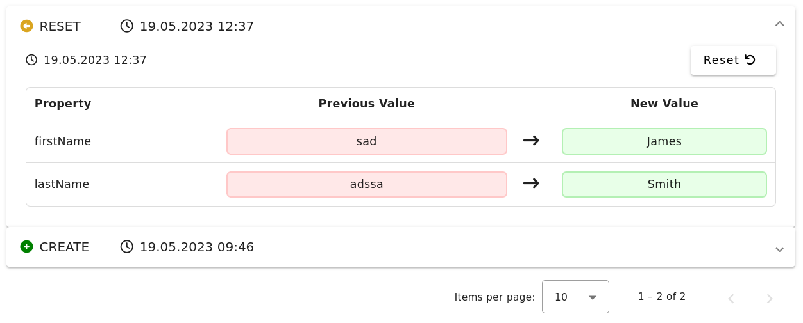

# NgxMaterialChangeSets

Provides functionality displaying change sets of entities in a history like ui.

Also adds options to reset or rollback to a specific change set.



# Requirements
This package relies on the [angular material library](https://material.angular.io/guide/getting-started) to render its components.

It also uses [fontawesome-icons](https://fontawesome.com/start) in some components.

# Usage
## ChangeSetService
To start using the change sets component you first need to provide a change set service.

This service provides default options for the component and handles logic like receiving change sets or rolling back.

```typescript
import { HttpClient } from '@angular/common/http';
import { Injectable } from '@angular/core';
import { BaseChangeSetService, ChangeSet } from 'ngx-material-change-sets';

@Injectable({ providedIn: 'root' })
export class ChangeSetService extends BaseChangeSetService {
    constructor(http: HttpClient) {
        super(http);
    }

    override async openCreatedBy(changeSet: ChangeSet): Promise<void> {
        // What to do when a user clicks on the "createdBy" link.
    }
}
```

If you want to change some of the default options you can overwrite their respective property on the service class.

You need to provide the service in your `app.module.ts`:

```ts
import { NGX_CHANGE_SET_SERVICE } from 'ngx-material-change-sets';
//...
providers: [
    {
        provide: NGX_CHANGE_SET_SERVICE,
        useExisting: ChangeSetService
    }
],
//...
```

## Use the component
First add the component to the imports array in your module or standalone component:
```ts
import { ChangeSetsComponent } from 'ngx-material-change-sets';
//...
imports: [
    //...
    ChangeSetsComponent
    //...
]
//...
```

Wherever you want to display the change history simply add:

```html
<ngx-mat-change-sets [entity]="entity" [changeSetsApiBaseUrl]="testBaseUrl">
</ngx-mat-change-sets>
```

Where entity needs to extent from `ChangeSetEntity` or `ChangeSetSoftDeleteEntity`. The base url is a string that will be provided to the rollback and reset methods of the change set service.
That way it can handle multiple different entity types.